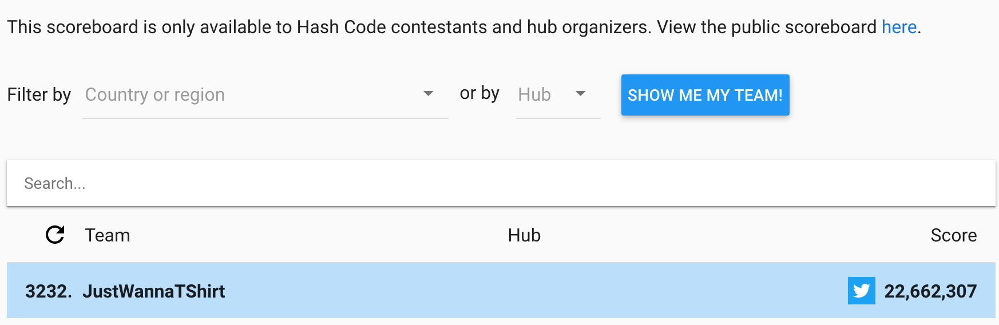
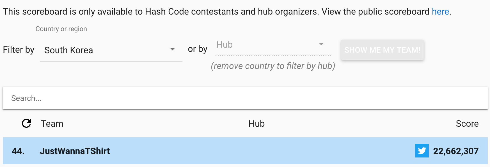

# [Hash Code](https://codingcompetitions.withgoogle.com/hashcode) 2020에 참가한 내용 정리

- 일자: 2020년 2월 21일 금요일 새벽 2시 45분 ~ 새벽 6시 45분
- 장소: 이정배 자취방
- 팀명: JustWannaTShirt
- 참가자: 이정배, 전태준, 고정완

## Score

점수: 22,662,307

- [등수](https://hashcodejudge.withgoogle.com/scoreboard)
  - 전체: 3232 / 10724
  - 한국: 44 / 70

